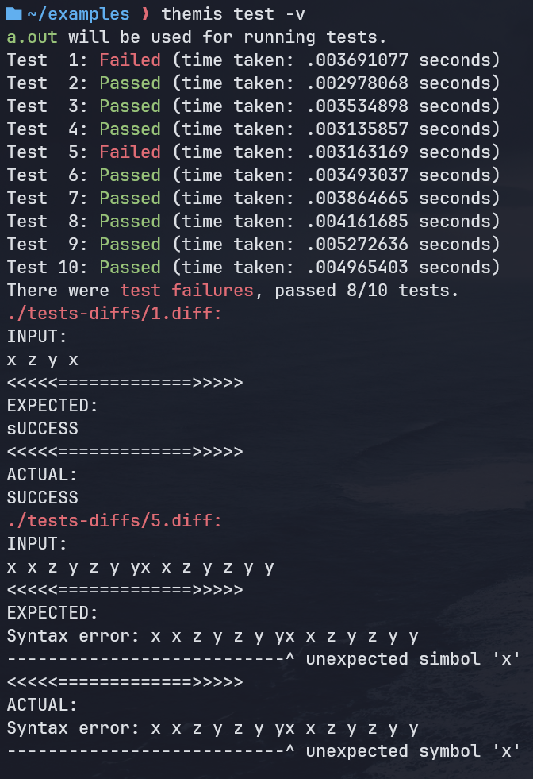
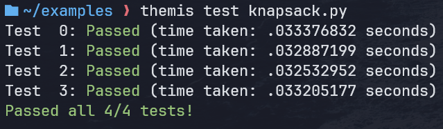

# Themis CLI


<!--toc:start-->
- [Themis CLI](#themis-cli)
  - [Examples](#examples)
  - [Installation](#installation)
  - [Requirements](#requirements)
  - [Features](#features)
  - [How to get started](#how-to-get-started)
    - [Verbose and no-redirect options](#verbose-and-no-redirect-options)
<!--toc:end-->


Made to work with Themis - Programming Judge of the RUG.

Use this cli tool to easily batch download test cases (and only test cases) and test your program against these downloaded test cases. Your program can either be an executable or a `.py` file.

## Examples



## Installation
To install themis cli globally using npm:
```
npm install -g themis_cli
```
After installing, you should now be able to use themis everywhere. To check try:
```
themis
```

## Requirements
**This tool requires** you to have `python3`, `requests`, and `beautifulsoup4` on your pc. To install the `requests` and `beautifulsoup4` libraries you can simply run the command:
```
pip install requests beautifulsoup4
```
Make sure you have `python3` installed before running the above command!

## Features
- Batch download test cases
- Run tests locally
- Save user name
- Save preferred year

## How to get started
Although not needed, if your are downloading test cases frequently it is nice to save your user name:
```
themis user <s_number>
```
It can also save some time to set the current academic year:
```
themis year
```
To check your saved username and year type:
```
themis info
```
We can start the test case downloading flow by typing:
```
themis get
```
This will run you through options until you are at the location where the tests you want are found.
This will download all the files to the `./tests/` directory.
If the tests directory is not present in your current directory it will create it.

Note, if you want to run `themis test [a.out]` on these tests, you should call `themis get` from within the directory where your executable will be located.

We can also judge our program locally. To do this, compile your code to an executable (or have a `.py` file) and:
```
themis test [a.out]
```
In this case `a.out` is just an example, any name for the executable would work.
This will test your program against the downloaded tests in the `./tests` directory.
It expects that the directory where you call `themis test [a.out]` from contains the `a.out` executable and the `tests` directory.
It will tell you how many test cases you passed and will store wrong output in the `./tests-diffs` directory.
If no executable is provided in the command (`themis test`) then the program will look for `a.out` or `main` (in that order).
So if your executable is called `a.out` or `main` you can just run `themis test`.

### Verbose and no-redirect options
The `themis test` command has 2 flags you can use: `-v` (`--verbose`) and `-n` (`--no-redirect`). `v` prints content of the failed tests' diff files, and `n` gives the tests files as an argument to the program (so instead of `./a.out < 1.in` you would get `./a.out 1.in`).

In the end we get a project directory that looks something like:
```
assignmentDir
│
├── main.c
├── main (executable)
│
├── tests
│   ├── 1.in
│   ├── 1.out
│   ├── 2.in
│   └── 2.out
│
└── tests-diffs
    └── 2.diff
```
Where calling `themis get` from assignmentDir would have yielded the `tests` directory and `themis test` would have yielded the `tests-diffs` directory if our program passed test case 1 but not test case 2.
Note that we can use `themis test` in this case because our program executable is called `main`.
